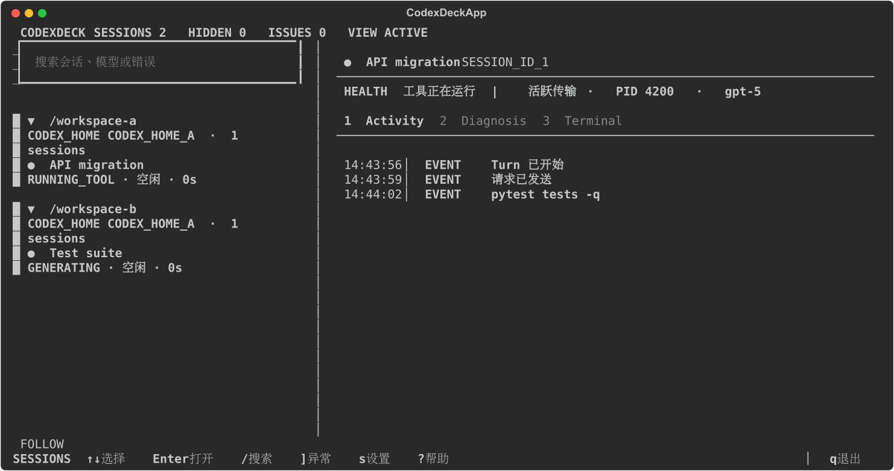
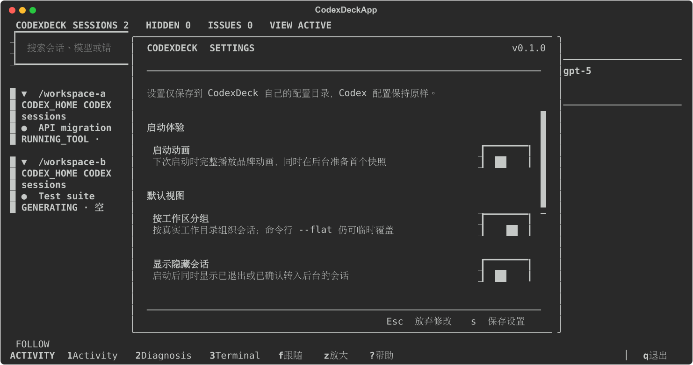
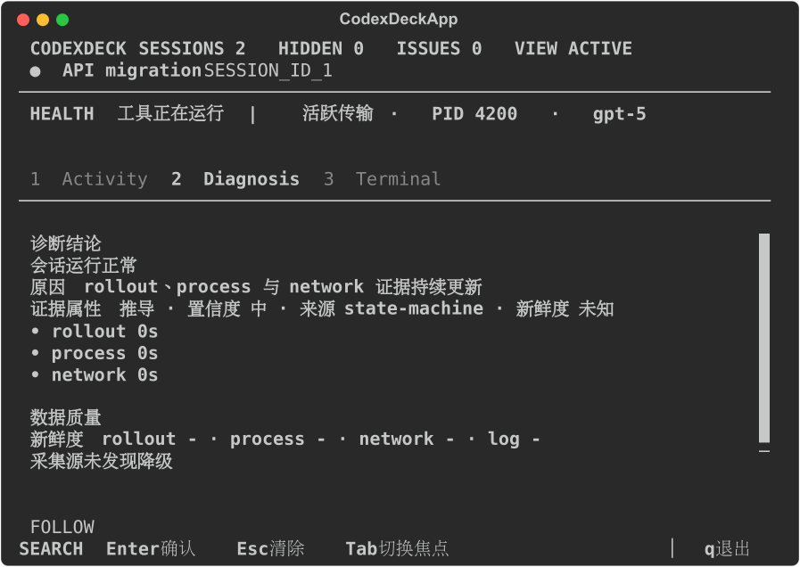
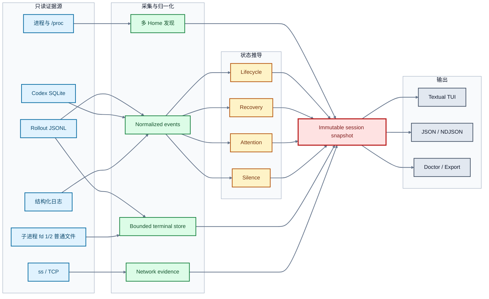

<div align="center">

# CodexDeck

### 所有本地 Codex 会话，一块准确、只读的运行态观测控制台

[](https://github.com/Telecaster2147/CodexDeck)
[](https://www.python.org/)
[](https://textual.textualize.io/)
[](#运行要求)
[](#只读与隐私边界)
[](LICENSE)
[](https://github.com/Telecaster2147/CodexDeck/commits)
[](https://github.com/Telecaster2147/CodexDeck/stargazers)

</div>

<br>

> [!NOTE]
> **项目状态：** 当前公开版本为 `0.2.0`；项目正在按本地 `TODO.md` 执行产品表面收敛。核心
> identity、lifecycle、attention、Terminal 与只读边界保持稳定，optional collector、持久化和
> 输出适配器正在分阶段评估或退出。



<p align="center">
  <sub>六个匿名会话同时覆盖生成、待审批、后台终端、恢复、网络停顿和采集盲区。</sub>
</p>

Codex CLI 擅长完成单个会话中的交互，但当多个工作区、后台命令和 Codex Home 同时运行时，
运行状态会分散在不同终端和数据源中。CodexDeck 不接管任务，而是汇总当前用户可读的
协议、进程、终端和网络证据，集中回答三个问题：

- **谁还在工作？** 当前是在生成、compact、运行具体工具，还是等待上游响应？
- **谁需要处理？** 哪个会话正在等待审批、权限、输入或登录，哪个会话刚刚失败？
- **谁真的停顿？** 静默是正常等待、已恢复的旧故障、采集盲区，还是多窗口证据确认的 stall？

这些结论来自同一份只读快照，并保留证据来源与新鲜度：

| Codex 原生使用中的不便 | CodexDeck 如何补齐 |
| --- | --- |
| 多个 Codex 会话散落在不同终端，需要逐个切换确认状态 | 自动发现当前用户的会话，按真实工作区分组，并区分不同 Codex Home |
| 界面上的静默很难判断是仍在生成、等待上游、执行工具还是已经停顿 | 组合 rollout、进程和网络证据，给出明确生命周期、静默判断与证据新鲜度 |
| 后台 exec 离开首个输出后，命令、PID、后续 poll 和最终结果不容易连贯追踪 | 把 Codex 已持久化的初始 exec、yield、poll/write、子进程和完成记录关联为同一个只读 Terminal transcript |
| 审批、权限、用户输入、登录等待和模型失败混在各自会话中 | 在统一导航中突出 action required、失败、恢复和异常会话，并可一键跳转 |
| TCP 已连接并不代表模型仍在推进，单一信号容易造成误判 | 以协议事件决定生命周期，网络只作为支持证据，并聚合同进程的全部连接 |

> [!IMPORTANT]
> CodexDeck 只观察。它不修改 Codex 配置、rollout、SQLite、进程、PTY 或网络流量。

## 快速开始

### 一键安装

安装器只写入当前用户目录，不需要 root。建议先下载并检查脚本，再执行：

```bash
curl -fsSL \
  https://raw.githubusercontent.com/Telecaster2147/CodexDeck/v0.2.0/install.sh \
  -o /tmp/codexdeck-install.sh

less /tmp/codexdeck-install.sh
sh /tmp/codexdeck-install.sh
codexdeck
```

安装器会完成以下工作：

1. 检查 Linux、Python 3.10+ 与 `ps`；缺少 `ss` 时只停用网络证据
2. 解析最新 GitHub Release，下载对应 wheel 和 `.sha256`
3. 强制校验 SHA-256
4. 在 `~/.local/share/codexdeck` 中创建独立虚拟环境
5. 创建 `~/.local/bin/codexdeck` 命令链接
6. 在交互式终端中询问是否启用提示音，并立即播放完成提示音供确认

在 VS Code Remote / WSL 终端中选择启用提示音后，安装器会优先检查远端 Machine
Settings（通常是 `~/.vscode-server/data/Machine/settings.json`），开启 terminal bell 的声音与
视觉信号，并在首次修改前于同目录保留 `settings.json.codexdeck-backup`。CodexDeck 自身的
completion 和 attention 提示音也会一并启用。若 VS Code 已经打开，按安装器提示 reload window
后再测试。

自动化安装可用 `--configure-sound` 直接配置，或用 `--skip-sound-setup` 跳过询问；
`--no-color`（以及通用的 `NO_COLOR` 环境变量）可关闭安装器颜色：

```bash
sh /tmp/codexdeck-install.sh --configure-sound
```

如 `~/.local/bin` 尚未位于 `PATH`，安装器会打印需要添加的目录。固定安装某个版本：

```bash
sh /tmp/codexdeck-install.sh --version 0.2.0
```

升级时重新运行安装器即可。旧版本只有在新环境安装并通过 `codexdeck --version` 验证后才会被替换。

### 卸载

```bash
curl -fsSL \
  https://raw.githubusercontent.com/Telecaster2147/CodexDeck/v0.2.0/uninstall.sh \
  -o /tmp/codexdeck-uninstall.sh

less /tmp/codexdeck-uninstall.sh
sh /tmp/codexdeck-uninstall.sh
```

默认保留 `~/.config/codexdeck` 中的界面偏好。需要同时清理 CodexDeck 配置时使用：

```bash
sh /tmp/codexdeck-uninstall.sh --purge-config
```

卸载器会验证 `~/.local/bin/codexdeck` 确实指向 CodexDeck 的安装目录，不会覆盖或删除同名的其他程序。

### 从源码运行

```bash
git clone https://github.com/Telecaster2147/CodexDeck.git
cd CodexDeck
uv sync
uv run codexdeck
```

也可以从当前 checkout 安装独立命令：

```bash
pipx install .
codexdeck
```

安装脚本也支持本地或自托管 wheel；必须同时提供 SHA-256 文件：

```bash
./install.sh \
  --wheel dist/codexdeck-0.2.0-py3-none-any.whl \
  --checksum dist/codexdeck-0.2.0-py3-none-any.whl.sha256
```

直接运行且 stdin/stdout 都连接到 TTY 时进入 Textual；管道或文件环境默认采样一次后退出。

```bash
# 两秒采样窗口后输出一次文本
codexdeck monitor --once

# 输出一次完整 JSON 快照
codexdeck monitor --once --format json

# 检查 discovery、数据源和采集能力
codexdeck doctor
```

## 界面导览

### 设置中心

设置只写入 CodexDeck 自己的配置目录，Codex 配置保持原样。



### 窄屏下钻

低于 96 列时切换为列表/详情下钻；低于 `50×20` 时给出明确尺寸提示。

<p align="center">
  
</p>

Inspector 有三个固定页面：

| 页面 | 关注点 |
| --- | --- |
| **Activity** | 请求、模型、工具、文件、compact、恢复和失败等语义时间线 |
| **Diagnosis** | 当前结论、关键证据、采集质量、数据新鲜度和已脱敏错误详情 |
| **Terminal** | 当前后台任务的只读 transcript，保留 `OUT`、`ERR`、`TTY`、`SYS` 来源 |

### 常用快捷键

| 导航 | 视图 | 搜索与跟随 | 系统 |
| --- | --- | --- | --- |
| `j` / `k` 或 `↑` / `↓` 移动 | `1` Activity | `/` 会话筛选；Terminal 内搜索输出 | `r` 完整采样 |
| `Enter` 展开或进入详情 | `2` Diagnosis | `n` / `Shift+N` 切换匹配 | `s` 设置 |
| `]` 下一个异常会话 | `3` Terminal | `f` 末尾自动跟随 | `?` 帮助 |
| `Esc` 返回或取消 | `g` 分组/扁平 |  | `q` / `Ctrl+C` 退出 |
| `Tab` / `Shift+Tab` 切换焦点 | `h` 活跃/全部会话 |  |  |
|  | `z` 放大当前区域 |  |  |

## 能力地图

| 领域 | 采集与解释能力 |
| --- | --- |
| **多实例发现** | 名称/argv 只产生候选；由官方环境、活动 rollout/SQLite 文件或已确认进程的直接 ancestry 确认，实例身份为 `(CODEX_HOME, CODEX_SQLITE_HOME)` |
| **真实工作区分组** | 按会话实际 cwd 分组，Codex Home 作为次级元数据；支持扁平视图和多 Home 对照 |
| **协议生命周期** | 保留请求发送、响应开始、生成、工具运行/完成、compact、完成、失败与中止 |
| **模型元数据** | 从 `turn_context` 与 thread settings 读取模型和 reasoning effort，并跨短暂 SQLite miss 保留 |
| **精确工具身份** | 展示具体工具、嵌套调用、命令、cwd、参数、受影响文件和子工具名 |
| **Terminal 关联** | 按 process ID 优先、call ID 次之，关联初始 exec、yield、poll/write 与完成记录 |
| **静默判断** | 区分活跃但无协议事件、等待上游、证据不足、疑似停顿和观察器盲区 |
| **网络证据** | 聚合进程全部连接的队列、收发/ACK 增量与重传；连续两个异常窗口后确认 stall |
| **Compact 观测** | 从 rollout 与结构化 SQLite 日志保留 requested/running/terminal 边界 |
| **多种输出** | Textual TUI、文本、JSON/NDJSON、doctor 与单会话 export |

## 工作原理



### 双采样节奏

| 节奏 | 负责内容 | 明确不做的事 |
| --- | --- | --- |
| **完整采样 · 默认 2 秒** | 进程发现、SQLite、socket、采集器健康、stale 状态、普通文件 tail、历史快照入队 | 不改变 Codex 运行状态，不等待历史库写入 |
| **快速刷新 · 100 毫秒** | 增量读取已知活动 rollout，更新协议事件与持久化 terminal 记录 | 不重扫进程，不调用 `ss`，不查 SQLite，不抓包，不写历史 |

完整采样中的 `ps` 与 `ss` 使用流式硬预算，不会先把全量主机输出读入内存。`ps` 优先按当前 UID
或显式 PID 选择，并在保留前逐行丢弃非 Codex candidate；`ss` 逐行只保留目标 Codex PID 的 socket
header 与其 continuation。stdout/stderr 字节、行数、保留记录或 wall time 超限时会终止并回收子进程，
本轮标记 incomplete，继续使用上一份完整 process/socket 集合；退出码为 0 但出现 stderr 也按
incomplete 处理。Doctor 和 JSON 发布实际读取、保留、过滤、丢弃与完整性统计。
Linux `ss` 没有本项目可依赖的 PID-only 源端查询合同，因此它仍读取全局 netlink 输出，但只在上述
硬预算内逐行检查，非目标记录不会进入长期 buffer 或 snapshot；这是当前公开的能力边界。

每条 JSONL 增量来源每 tick 最多读取 512 KiB、处理 512 条记录并使用 50 ms 解析量子；单条记录
硬上限为 256 KiB。每个 rollout 按一来源一个量子顺序获得服务，
因此热文件不会吞掉其他 session 的采样机会。cursor 只推进已消费字节；普通 incomplete line 留待
下一轮，超长无换行记录进入有界 skip-to-delimiter，发布 generation 内累计 skipped bytes、摘要 hash
和 explicit gap。达到预算时继续从当前 offset 追赶，不静默跳到文件尾，也不合并 lifecycle、attention、
failure、terminal completion 或 semantic unknown；当前实现不对辅助事件做有损 coalesce。

snapshot、doctor、TUI Diagnosis、JSON 统一公开 backlog bytes、已知 record 下界、age、
budget-exceeded、oversize/gap 与 skipped bytes。积压清空后恢复实时观察；若发生超长记录，显式 gap
继续保留为该 generation 的协议质量事实，后续关键事件仍按顺序交付。

可变 rollout JSONL 流使用 `(path digest, device, inode, generation, offset, content anchor)` 身份。
replace、truncate 或尾部锚点变化会开启新 generation，source ID 不依赖外部 timestamp；旧 generation
延迟记录由状态机丢弃。若只观察到相同大小文件的 mtime 变化而尾部锚点未变，CodexDeck 不猜测纯
append，也不重放相同内容，而是发布 `stream_uncertain`、generation、anchor hash 和原因。

没有新事件或 terminal 更新时，快速路径直接复用已有 snapshot，TUI 因而不会无意义重绘、抢焦点或把滚动位置推到底部。

observer 为 full/fast sample 记录 scheduled、started、completed、duration、scheduling/event-loop lag、
skipped/coalesced tick、连续超期、worker in-flight age、最近成功时间和 snapshot age。单次抖动只保留
证据；连续两次超期或 snapshot age 超过两个完整 cadence 才标记 `observer degraded`。该状态不覆盖
Codex lifecycle，并在 persistent status、text、JSON 和 doctor 中使用同一摘要。

`MonitorSnapshot` 不是所有字段同时发生的单点 cut，而是显式的 `composite_interval`。process、rollout、
terminal、SQLite 与 socket 分别发布 observed window、source generation、valid-through、
stale age 与 completeness。fast refresh 继承旧 full-sample process/socket/SQLite 时间，不把新的
`generated_at` 当作这些来源的新鲜时间。当前最大混合 skew 为两个 full cadence；超限发布
`TEMPORAL_SKEW`，跨来源 ownership/health 结论按不完整证据解释。PID reuse 仍由 `(pid,start_time)`、
socket reopen 由 flow identity、rollout replace/truncate 由 generation 单调区分。

### 五条独立状态轴

| 状态轴 | 典型值 |
| --- | --- |
| **Lifecycle** | `IDLE` · `WAITING_RESPONSE` · `GENERATING` · `RUNNING_TOOL` · `COMPACTING` · `FAILED` |
| **Recovery** | `SUSPECT` · `RECONNECTING` · `TRANSPORT_FALLBACK` · `RECOVERED` |
| **Attention** | `APPROVAL` · `PERMISSIONS` · `USER_INPUT` · `MCP_ELICITATION` · `AUTH_ELICITATION` |
| **Network** | `UNKNOWN` · `IDLE` · `ACTIVE` · `SUSPECT` · `STALLED` · `CLOSED` |
| **Silence** | `NORMAL` · `QUIET_ACTIVE` · `WAITING_UPSTREAM` · `QUIET_UNKNOWN` · `STALL_SUSPECT` · `OBSERVER_BLIND` |

协议事件决定会话生命周期；网络只提供支持证据。keepalive、token 更新、旧错误和单条连接都不会覆盖当前 live phase。

### 六轴证据完整性

每个会话同时发布 `lifecycle`、`attention`、`failure_recovery`、`terminal_ownership`、
`network` 和 `silence` 的独立 completeness。`complete=false` 表示当前显示值可能是“未观察到”，
不能解释为明确 absent/healthy。主导航、Inspector、text、JSON、doctor 和退出码使用同一
`SessionCompleteness` 值。

| 轴 | 正证据 | 权威 clear / baseline |
| --- | --- | --- |
| lifecycle | request、response、model、tool、compact 或 terminal phase | `TURN_STARTED`、明确 phase、turn terminal、process resume/exit |
| attention | `ACTION_REQUIRED` | `ACTION_RESOLVED` 或更晚的可信 progress/terminal/process clear |
| failure/recovery | failure、reconnect、fallback、recovered | 新 turn、可信 progress、terminal 或 process clear |
| terminal ownership | 当前 terminal 记录 | 完整 process-tree 探针加无冲突 association，或缺口后的 terminal completion |
| network | 当前 socket/queue/counter 证据 | 新鲜且完整的 socket snapshot；不由 rollout baseline 代替 |
| silence | 当前 observer-blind 正证据或静默分类 | 完整 observation probes 加完整 lifecycle baseline |

冷启动只读尾部会公开 context-truncated；缺少当前基线时保持保守，尾部或后续实时记录中的可信
基线会逐轴恢复完整度。超长记录 skip、copy-truncate 和 generation 变化会建立显式 gap。500-event
retention 只限制公开时间线，状态机用有界轴基线保留当前 lifecycle/attention 等结论。TUI 在首次公开
快照前追平有界冷启动 backlog；运行中的新 backlog 仍临时降级，追平且没有数据丢失时恢复连续覆盖。

协议或关联判定的独立反例集位于 `tests/fixtures/ground_truth_manifest.json`，裁决流程见
`tests/fixtures/ground_truth_manifest.json`。反例分为 true positive、false positive、false negative、
ambiguous 和 unresolved；可复现误判先进入匿名语料，再修改识别逻辑。

## Terminal 可观测性

CodexDeck 不把 `NormalizedEvent.detail` 拼成伪终端，而是维护独立、有界、可搜索的 transcript 域。

| Capability | 何时出现 |
| --- | --- |
| `FILE_TAIL` | 子进程 fd 1/2 指向 workspace 或 `/tmp` 下允许读取的普通文件 |
| `POLL_TRANSCRIPT` | Codex 写入初始 yield 或后续 poll/write 结果时，持久化 transcript 随记录增长；不是字节级实时流 |
| `FINAL_TRANSCRIPT` | 只有完成记录或聚合输出可用 |
| `METADATA_ONLY` | 能看到命令/进程元数据，但没有可读输出 |

普通 Codex TUI rollout 不公开其进程内瞬时 output delta。CodexDeck 只展示已经形成耐久证据的
poll/final transcript，或符合边界检查的普通文件 tail，不附着或消费 Codex PTY。

| 保留范围 | 上限 |
| --- | ---: |
| 单个 terminal | 2 MiB 或 4,000 chunks |
| 单个 Codex 会话 | 16 terminals |
| 全局 | 16 MiB |
| 单个会话标准化事件 | 最新 500 条 |

UTF-8 跨读取增量解码，终端控制序列在渲染前移除；上游截断与 CodexDeck 自身 trim 分别标记，并显示 dropped bytes。
session/workspace/command/tool/status/failure 等操作判断字段会把 bidi control、零宽字符和其他
default-ignorable 字符可视化为 `<U+XXXX>`，并按 display-cell width 截断；连续 combining marks 有独立
上限。Terminal 的 `OUT`、`ERR`、`TTY`、`SYS` 列由 CodexDeck 固定生成，transcript 内容不能伪造或
改变相邻行 provenance。检测到关键字段含不可见字符时发布 `UNICODE_INVISIBLE` diagnostic。

## CLI 工作流

### 监控与筛选

```bash
# 默认交互 TUI
codexdeck

# 持续 NDJSON，每行一个 schema 1 snapshot
codexdeck monitor --watch --format ndjson

# 指定 PID、Home 或扁平视图
codexdeck monitor --pid PID
codexdeck monitor --codex-home CODEX_HOME_A --codex-home CODEX_HOME_B
codexdeck monitor --flat

# 文本/JSON 中同时显示 launcher、app-server 和辅助进程
codexdeck monitor --once --all

# 将 observer blind/stale/unknown/budget/conflict 与 workload incident 分开用于自动化
codexdeck monitor --once --format json --strict-observation
```

普通 one-shot 的退出 `0` 只表示当前 snapshot 未命中 workload incident，不表示所有来源完整可信。
`--json` 暂时作为 `--format json` 的兼容别名；持续输出必须显式使用
`--watch --format ndjson`，text 与 pretty JSON 始终 one-shot。
`--strict-observation` 在没有更高优先级 workload failure/stall 时，以退出码 `5` 报告 active observer
degradation；JSON 中仍同时保留全部结构化 diagnostic。稳定 code、隐私字段和组合优先级见公开诊断。

<details>
<summary><strong>Doctor：检查数据源与降级原因</strong></summary>

```bash
codexdeck doctor
codexdeck doctor --json
```

`doctor` 立即执行一次完整只读采样，不等待普通监控的基线窗口。JSON 使用独立的
`doctor_schema_version: 2`，并分别报告 `workload_status`、`observer_status`、可选能力 warning 和
兼容性 info。

</details>

<details>
<summary><strong>Export：导出单会话的有界当前报告</strong></summary>

```bash
codexdeck export --session SESSION_ID
```

会话导出包含最多 500 条保留事件、turn/tool/compact 摘要、恢复链、告警、失败信息和 TCP 证据。
输出使用 `export_schema_version: 3`，并移除 terminal transcript 正文。来源是一次新进程采样、
rollout lookback 和状态机最多 500 条 retained events。

</details>


运行 `codexdeck --help` 或子命令的 `--help` 查看完整参数。

## 输出契约

| 输出 | 适用场景 | Transcript 正文 |
| --- | --- | --- |
| TUI | 交互观察、搜索与定位当前后台任务 | 仅在有界内存 Terminal 视图中显示 |
| Text | shell 管道与快速巡检 | 不输出 |
| JSON / NDJSON | 自动化采集，`schema_version: 1` | 不输出，只包含 terminal summaries |
| Doctor | 数据源、路径、schema 与 collector 健康诊断 | 不输出 |
| Export | 单会话有界当前报告 | 不输出 |

### 证据与发布合同

- `MonitorSnapshot` 是一次已发布的观察结果。没有可见变化时复用原对象；有变化时替换受影响分支，
  已发布对象及其嵌套值不得被后续采样修改。
- lifecycle 由已知的结构化 protocol phase 决定；process、terminal、socket 与 SQLite 证据
  只能补充各自负责的事实，不替代 protocol lifecycle。
- instance、session、process、rollout、terminal 与 socket 使用各自的复合身份。展示用短 ID 不作为
  跨来源归属的充分证据。
- 进程名和 argv 只是 discovery candidate。官方 `CODEX_HOME`/`CODEX_SQLITE_HOME`、活动 rollout
  及其 session identity、活动 Codex SQLite 文件属于直接确认来源；仅直接父子关系可从已确认进程
  继承中等 confidence。默认 `~/.codex` 和配置文件本身不确认进程身份。直接来源指向不同 Home 时
  fail-closed 为 unresolved；未确认候选不进入 socket、SQLite、rollout 或 session 发布管线。
- doctor 公开有界的 candidate、confirmed、rejected、unresolved 计数以及每个已确认进程的 method、
  confidence 和 evidence。人工标注采样可计算 precision/recall；没有标注时保持 null，避免把当前
  样本的零误报解释成全局发现率。
- 缺失、截断、陈旧、冲突或未知 shape 不等价于“明确不存在”。只有对应状态轴具备完整基线或权威
  clear evidence 时，才发布确定的负面结论。
- `SessionCompleteness` 为六个操作判断轴分别记录 `complete`、confidence、reason、baseline kind/time
  和有界 evidence。cold-start tail、explicit gap、generation change 与 500-event retention 不使用一个
  全局 truncated boolean 代替；network 保持独立，terminal ownership 还要求当前进程树与关联探针。
- 未知记录按稳定枚举区分 `auxiliary`、`lifecycle`、`attention` 与 `terminal`。若最新语义证据仍是
  后三类 unknown，导航、Inspector、text、JSON 与 doctor 统一显示协议不确定，并将对应 confidence
  降为 `low`；更晚的已知 progress 会恢复结论，旧 unknown 和辅助 telemetry 不覆盖新证据。
- 每个 normalized event 分开保存 producer `source_timestamp`、CodexDeck `observed_at` 和状态机
  `adjudicated_at`。来源时间用于展示与同来源正常区间，观察时间用于 freshness，裁决时间只用于
  跨来源状态排序、retention 和单调 clear。rollout 允许 5 秒 future skew 与 2 秒回拨，
  SQLite log/SSE 允许 120/120 秒，本地 process/detector 允许 2/1 秒；这些容差对应
  各 producer 的写入与采样行为，不是一个全局阈值。超界、零时间戳和 observer wall-clock 回拨会
  降低 clock trust 并记录采用的裁决时间。future attention 不压住后来观察到的 resolution，旧 failure
  不因回拨复活，terminal completion 与 process exit 使用单调 clear 规则。最新同来源可信事件会
  清除当前 clock uncertainty，历史事件仍保留原始来源时间。
- terminal 关联遇到身份冲突时按 fail-closed 处理，不把可能属于其他 session、workspace 或 Codex
  home 的 transcript 发布到当前会话。每个 terminal summary 同时公开 association status、最终
  correlation source 与原因；会话聚合只对当前有界保留窗口报告 eligible、associated、ambiguous、
  conflicting、unresolved 和 dropped 原始计数。缺少标注样本时 `precision` 保持 null，不把零误归属
  宣传成全局 recall。
- collector 保持只读。诊断和公开输出只使用有界数据；terminal transcript 正文仅保留在
  本地有界内存 TUI 中。

### Machine-readable schema 兼容政策

当前仍处于 Alpha。核心 JSON/NDJSON 是唯一稳定的 machine API，当前
`schema_version: 1`。单会话报告使用 `export_schema_version: 3`，在 1.0 前只承诺同一 minor
版本内兼容，breaking change 会记录在 release note。Doctor 是诊断面，可随 minor 提升
`doctor_schema_version`，不逐字段承诺弃用周期。replay manifest 与 fixtures 仅为仓库测试资产。

- 在现有对象中增加可忽略的 nullable 字段属于 additive change，可保持当前 schema version。
- 删除或重命名字段、改变字段类型、改变枚举含义、改变 nullability，或改变同一字段的领域语义，
  属于 breaking change，必须提升对应 surface 的 schema version。
- 新领域字段默认不进入公开 machine-readable surface。加入公开 schema 时需要同时声明隐私边界、
  长度上限、脱敏行为和兼容性影响。
- 核心 JSON/NDJSON 的 breaking change 必须提升 schema version；同一 minor 内保持旧合同。
- README、CLI help、实现常量与合同测试共同约束公开版本文案。

新增 machine-readable 字段遵循 additive/breaking 语义，默认保持私有，公开前需同时具备
长度边界、脱敏、投影和回归测试。

## 设置

按 `s` 打开设置，可持久化分组、隐藏会话、自动跟随、关键操作通知、终端提示音和主题。
Activity 固定为默认页面；主题只通过设置页切换。提示音 master 默认关闭，长任务完成类别默认启用、
attention 类别默认关闭；仅 TUI 使用终端 BEL，非交互输出保持静默。

```text
$XDG_CONFIG_HOME/codexdeck/preferences.json
```

未设置 `XDG_CONFIG_HOME` 时使用 `~/.config/codexdeck/preferences.json`。命令行 `--flat` 只覆盖本次运行。

## 只读与隐私边界

- 不 attach 或消费 Codex PTY，不复制输出端点
- 不写 stdin，不发 signal，不使用 ptrace/eBPF 注入，不触发额外 poll
- 普通文件 tail 只检查子进程 fd 1/2，且目标必须位于 session workspace 或 `/tmp`
- 跳过 PTY、pipe、socket、字符设备和无关 open files
- rollout、SQLite、配置、进程与网络流量始终保持原样
- transcript 在展示前执行控制序列清理，并对 Bearer/Basic auth、常见 token、AWS access key、JWT、
  带凭据 URL/DSN、PEM private key 和 Cookie header 等已知格式执行 best-effort 脱敏；这不是任意秘密
  检测保证，自定义格式、无上下文字段和未知凭据仍可能保留。为避免破坏 session ID、hash、trace ID
  等正常诊断值，CodexDeck 不按“高熵”单一特征自动替换所有随机字符串
- JSON、NDJSON、export 与默认文本输出都不包含 transcript 正文
- domain dataclass 不是公开 DTO；JSON/NDJSON、export 与 doctor 使用 deny-by-default 类型字段清单，
  event metadata 和 rollout activity 另有键 allowlist。新增内部字段或未知嵌套 metadata 默认不公开，
  公开字段通过显式 allowlist 投影，新增字段默认不公开
- 当来源可包含任意 user/tool 输出、缺少稳定 schema、内容与 metadata 边界不清，或已知格式脱敏会让
  文本失去诊断价值时，持久化与默认公开投影停止保存该文本，改用类别、长度、hash 和 provenance

> [!NOTE]
> Terminal transcript 是敏感的本地内存数据。会话标题、任务摘要、路径、网络端点、未知格式秘密和
> best-effort 脱敏后的错误仍可能出现在交互界面或适用的诊断输出中；分享截图、导出片段或终端内容
> 前需要人工检查。

### 本地性能证据

`uv run python tools/benchmark_core.py` 是可复核、非门禁测量，不是产品 SLO。rollout 结果分别标记
`rollout_full_small`、`rollout_cold_start_tail`、`rollout_incremental_append`、
`rollout_copy_truncate` 和 `multi_rollout_burst`，同时报告文件总大小、reader 实际读取字节、解析/忽略
记录、保留事件与 ingress ticks。MiB/s 只以实际读取字节为分子；无 tracemalloc 的 runtime 与开启
tracemalloc 的时间/峰值分开；`read_amplification` 显式显示 parse wall budget 回退后可能发生的重复
读取，不假设实际读取量小于文件大小。SQLite、`ps`、`ss`、terminal 更新和 filesystem contention 也各自输出
独立 measurement。测量结果携带 snapshot age/遗漏更新字段，但只有 P1 responsiveness/PTY 记录才能
支持用户输入延迟或界面流畅性结论。

## 运行要求

| 项目 | 要求 |
| --- | --- |
| 操作系统 | Linux |
| Python | 3.10+ |
| 系统命令 | 必需：`ps`；可选网络证据：`ss`（通常来自 `iproute2`） |
| Python UI | Textual `>=8.2.8,<9` |
| 权限 | 当前用户 Codex 进程、`/proc` 与对应 Codex 数据目录的读取权限 |

缺少可选数据源时，其他采集器继续工作，并在 Diagnosis、doctor 和结构化输出中标记降级原因。

## 项目结构

```text
src/
├── cli.py / app.py          # CLI、运行模式与退出码
├── engine.py                # 采样编排、temporal cut 与 snapshot publication
├── engine_collectors.py     # 有界进程与 socket collector stages
├── engine_refresh.py        # 100ms rollout/terminal 快速刷新
├── state_machine.py         # session ledger、事件时间与推导入口
├── state_axes.py            # lifecycle/attention/failure/completeness axes
├── state_summaries.py       # turn/tool/agent 与 capability 有界摘要
├── models.py                # 领域模型和 immutable snapshot
├── codex/                   # 进程、路径、SQLite、rollout、事件与 terminal 读取器
├── network/                 # ss 与 TCP 状态分类
└── presentation/            # text、JSON、doctor、export 与 Textual TUI

tests/                       # unittest 与 Textual Pilot 行为测试
assets/screenshots/          # 预渲染的匿名 Textual README 截图
codexdeck                    # 开发 checkout launcher
```

依赖方向保持为 `cli/presentation → app → engine → codex/network → models`。底层采集器不依赖 TUI。

## 许可证

CodexDeck 使用 [MIT License](LICENSE)。允许使用、修改、分发和商业使用，分发时需保留版权与许可证声明。

---

<div align="center">
  <strong>CodexDeck</strong><br>
  <sub>Observe every session. Preserve every boundary.</sub>
</div>
