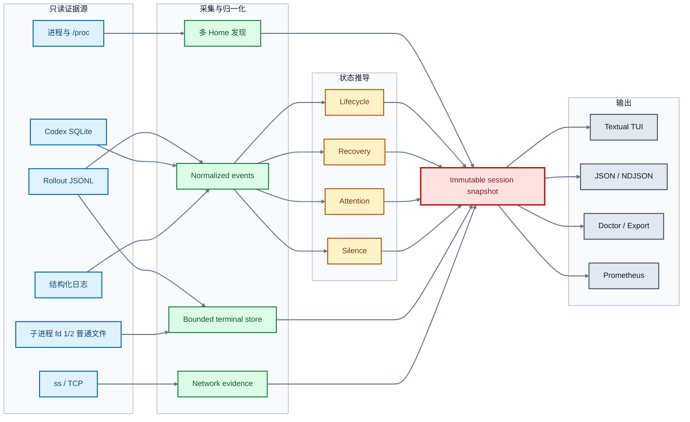

<div align="center">

# CodexDeck

### 所有本地 Codex 会话，一块准确、只读的运行态观测控制台

[](https://github.com/Telecaster2147/CodexDeck)
[](https://www.python.org/)
[](https://textual.textualize.io/)
[](#运行要求)
[](#只读与隐私边界)
[](LICENSE)
[](https://github.com/Telecaster2147/CodexDeck/commits)
[](https://github.com/Telecaster2147/CodexDeck/stargazers)

</div>

<br>


<p align="center">
  <sub>六个匿名会话同时覆盖生成、待审批、后台终端、恢复、网络停顿和采集盲区。</sub>
</p>

Codex CLI 擅长完成单个会话中的交互，但当多个工作区、后台命令和 Codex Home 同时运行时，
运行状态会分散在不同终端和数据源中。CodexDeck 不接管任务，而是汇总当前用户可读的
协议、进程、终端和网络证据，集中回答三个问题：

- **谁还在工作？** 当前是在生成、compact、运行具体工具，还是等待上游响应？
- **谁需要处理？** 哪个会话正在等待审批、权限、输入或登录，哪个会话刚刚失败？
- **谁真的停顿？** 静默是正常等待、已恢复的旧故障、采集盲区，还是多窗口证据确认的 stall？

这些结论来自同一份只读快照，并保留证据来源与新鲜度：

| Codex 原生使用中的不便 | CodexDeck 如何补齐 |
| --- | --- |
| 多个 Codex 会话散落在不同终端，需要逐个切换确认状态 | 自动发现当前用户的会话，按真实工作区分组，并区分不同 Codex Home |
| 界面上的静默很难判断是仍在生成、等待上游、执行工具还是已经停顿 | 组合 rollout、进程和网络证据，给出明确生命周期、静默判断与证据新鲜度 |
| 后台 exec 离开首个输出后，命令、PID、后续 poll 和最终结果不容易连贯追踪 | 把 Codex 已持久化的初始 exec、yield、poll/write、子进程和完成记录关联为同一个只读 Terminal transcript |
| 审批、权限、用户输入、登录等待和模型失败混在各自会话中 | 在统一导航中突出 action required、失败、恢复和异常会话，并可一键跳转 |
| TCP 已连接并不代表模型仍在推进，单一信号容易造成误判 | 以协议事件决定生命周期，网络只作为支持证据，并聚合同进程的全部连接 |

> [!IMPORTANT]
> CodexDeck 只观察。它不修改 Codex 配置、rollout、SQLite、进程、PTY 或网络流量。

## 快速开始

### 一键安装

安装器只写入当前用户目录，不需要 root。建议先下载并检查脚本，再执行：

```bash
curl -fsSL \
  https://raw.githubusercontent.com/Telecaster2147/CodexDeck/v0.1.1/install.sh \
  -o /tmp/codexdeck-install.sh

less /tmp/codexdeck-install.sh
sh /tmp/codexdeck-install.sh
codexdeck
```

安装器会完成以下工作：

1. 检查 Linux、Python 3.10+、`ps` 与 `ss`
2. 解析最新 GitHub Release，下载对应 wheel 和 `.sha256`
3. 强制校验 SHA-256
4. 在 `~/.local/share/codexdeck` 中创建独立虚拟环境
5. 创建 `~/.local/bin/codexdeck` 命令链接

如 `~/.local/bin` 尚未位于 `PATH`，安装器会打印需要添加的目录。固定安装某个版本：

```bash
sh /tmp/codexdeck-install.sh --version 0.1.1
```

升级时重新运行安装器即可。旧版本只有在新环境安装并通过 `codexdeck --version` 验证后才会被替换。

### 卸载

```bash
curl -fsSL \
  https://raw.githubusercontent.com/Telecaster2147/CodexDeck/v0.1.1/uninstall.sh \
  -o /tmp/codexdeck-uninstall.sh

less /tmp/codexdeck-uninstall.sh
sh /tmp/codexdeck-uninstall.sh
```

默认保留 `~/.config/codexdeck` 中的界面偏好。需要同时清理 CodexDeck 配置时使用：

```bash
sh /tmp/codexdeck-uninstall.sh --purge-config
```

卸载器会验证 `~/.local/bin/codexdeck` 确实指向 CodexDeck 的安装目录，不会覆盖或删除同名的其他程序。

### 从源码运行

```bash
git clone https://github.com/Telecaster2147/CodexDeck.git
cd CodexDeck
uv sync
uv run codexdeck
```

也可以从当前 checkout 安装独立命令：

```bash
pipx install .
codexdeck
```

安装脚本也支持本地或自托管 wheel；必须同时提供 SHA-256 文件：

```bash
./install.sh \
  --wheel dist/codexdeck-0.1.1-py3-none-any.whl \
  --checksum dist/codexdeck-0.1.1-py3-none-any.whl.sha256
```

当 stdin 与 stdout 都连接到 TTY 时，CodexDeck 自动进入 Textual 界面；管道或文件环境自动输出文本。

```bash
# 两秒采样窗口后输出一次文本
codexdeck --once

# 输出一次完整 JSON 快照
codexdeck --once --json

# 检查 discovery、数据源和采集能力
codexdeck doctor
```

## 界面导览

### 设置中心

设置只写入 CodexDeck 自己的配置目录，Codex 配置保持原样。


### 窄屏下钻

低于 96 列时切换为列表/详情下钻；低于 `50×20` 时给出明确尺寸提示。

<p align="center">
  
</p>

Inspector 有三个固定页面：

| 页面 | 关注点 |
| --- | --- |
| **Activity** | 请求、模型、工具、文件、compact、恢复和失败等语义时间线 |
| **Diagnosis** | 当前结论、关键证据、采集质量、数据新鲜度和已脱敏错误详情 |
| **Terminal** | 当前后台任务的只读 transcript，保留 `OUT`、`ERR`、`TTY`、`SYS` 来源 |

### 常用快捷键

| 导航 | 视图 | 搜索与跟随 | 系统 |
| --- | --- | --- | --- |
| `j` / `k` 或 `↑` / `↓` 移动 | `1` Activity | `/` 搜索当前区域 | `r` 完整采样 |
| `Enter` 展开或进入详情 | `2` Diagnosis | `n` / `Shift+N` 切换匹配 | `s` 设置 |
| `]` 下一个异常会话 | `3` Terminal | `f` 末尾自动跟随 | `?` 帮助 |
| `Esc` 返回或取消 | `g` 分组/扁平 |  | `q` / `Ctrl+C` 退出 |
| `Tab` / `Shift+Tab` 切换焦点 | `h` 活跃/全部会话 |  |  |
|  | `z` 放大当前区域 |  |  |
|  | `t` 循环主题 |  |  |

## 能力地图

| 领域 | 采集与解释能力 |
| --- | --- |
| **多实例发现** | 观察当前用户的全部 Codex 进程；实例身份为 `(CODEX_HOME, CODEX_SQLITE_HOME)` |
| **真实工作区分组** | 按会话实际 cwd 分组，Codex Home 作为次级元数据；支持扁平视图和多 Home 对照 |
| **协议生命周期** | 保留请求发送、响应开始、生成、工具运行/完成、compact、完成、失败与中止 |
| **模型元数据** | 从 `turn_context` 与 thread settings 读取模型和 reasoning effort，并跨短暂 SQLite miss 保留 |
| **精确工具身份** | 展示具体工具、嵌套调用、命令、cwd、参数、受影响文件和子工具名 |
| **Terminal 关联** | 按 process ID 优先、call ID 次之，关联初始 exec、yield、poll/write 与完成记录 |
| **静默判断** | 区分活跃但无协议事件、等待上游、证据不足、疑似停顿和观察器盲区 |
| **网络证据** | 聚合进程全部连接的队列、收发/ACK 增量与重传；连续两个异常窗口后确认 stall |
| **Compact 观测** | 合并 rollout、typed TUI session log 与最小 hook 证据，保留 requested/running/terminal 边界 |
| **多种输出** | Textual TUI、文本、JSON/NDJSON、doctor、export、Prometheus 与可选独立历史库 |

## 工作原理



### 双采样节奏

| 节奏 | 负责内容 | 明确不做的事 |
| --- | --- | --- |
| **完整采样 · 默认 2 秒** | 进程发现、SQLite、socket、采集器健康、stale 状态、普通文件 tail、历史写入 | 不改变 Codex 运行状态 |
| **快速刷新 · 100 毫秒** | 增量读取已知活动 rollout，更新协议事件与持久化 terminal 记录 | 不重扫进程，不调用 `ss`，不查 SQLite，不抓包，不写历史 |

没有新事件或 terminal 更新时，快速路径直接复用已有 snapshot，TUI 因而不会无意义重绘、抢焦点或把滚动位置推到底部。

### 五条独立状态轴

| 状态轴 | 典型值 |
| --- | --- |
| **Lifecycle** | `IDLE` · `WAITING_RESPONSE` · `GENERATING` · `RUNNING_TOOL` · `COMPACTING` · `FAILED` |
| **Recovery** | `SUSPECT` · `RECONNECTING` · `TRANSPORT_FALLBACK` · `RECOVERED` |
| **Attention** | `APPROVAL` · `PERMISSIONS` · `USER_INPUT` · `MCP_ELICITATION` · `AUTH_ELICITATION` |
| **Network** | `UNKNOWN` · `IDLE` · `ACTIVE` · `SUSPECT` · `STALLED` · `CLOSED` |
| **Silence** | `NORMAL` · `QUIET_ACTIVE` · `WAITING_UPSTREAM` · `QUIET_UNKNOWN` · `STALL_SUSPECT` · `OBSERVER_BLIND` |

协议事件决定会话生命周期；网络只提供支持证据。keepalive、token 更新、旧错误和单条连接都不会覆盖当前 live phase。

## Terminal 可观测性

CodexDeck 不把 `NormalizedEvent.detail` 拼成伪终端，而是维护独立、有界、可搜索的 transcript 域。

| Capability | 何时出现 |
| --- | --- |
| `FILE_TAIL` | 子进程 fd 1/2 指向 workspace 或 `/tmp` 下允许读取的普通文件 |
| `POLL_TRANSCRIPT` | Codex 写入初始 yield 或后续 poll/write 结果时，持久化 transcript 随记录增长；不是字节级实时流 |
| `FINAL_TRANSCRIPT` | 只有完成记录或聚合输出可用 |
| `METADATA_ONLY` | 能看到命令/进程元数据，但没有可读输出 |
| `STREAMING` | 为未来官方、外部可订阅的只读 delta 源预留 |

普通 Codex TUI rollout 不公开其进程内瞬时 output delta。CodexDeck 只展示已经形成耐久证据的
poll/final transcript，或符合边界检查的普通文件 tail，不附着或消费 Codex PTY。

| 保留范围 | 上限 |
| --- | ---: |
| 单个 terminal | 2 MiB 或 4,000 chunks |
| 单个 Codex 会话 | 16 terminals |
| 全局 | 16 MiB |
| 单个会话标准化事件 | 最新 500 条 |

UTF-8 跨读取增量解码，终端控制序列在渲染前移除；上游截断与 CodexDeck 自身 trim 分别标记，并显示 dropped bytes。

## CLI 工作流

### 监控与筛选

```bash
# 默认交互 TUI
codexdeck

# 持续 NDJSON，每行一个 schema 1 snapshot
codexdeck --json

# 指定 PID、Home 或扁平视图
codexdeck --pid PID
codexdeck --codex-home CODEX_HOME_A --codex-home CODEX_HOME_B
codexdeck --flat

# 文本/JSON 中同时显示 launcher、app-server 和辅助进程
codexdeck --once --all
```

<details>
<summary><strong>Doctor：检查数据源与降级原因</strong></summary>

```bash
codexdeck doctor
codexdeck doctor --json
```

`doctor` 立即执行一次完整只读采样，不等待普通监控的基线窗口。JSON 使用独立的 `doctor_schema_version: 1`。

</details>

<details>
<summary><strong>Export：导出当前事件或单会话复盘</strong></summary>

```bash
codexdeck export --current-incidents
codexdeck export --session SESSION_ID
```

会话导出包含最多 500 条保留事件、turn/tool/compact 摘要、恢复链、告警、失败信息和 TCP 证据。
输出使用 `export_schema_version: 1`，并移除 terminal transcript 正文。

</details>

<details>
<summary><strong>Metrics：输出一次 Prometheus text format</strong></summary>

```bash
codexdeck metrics
```

这是一次性输出，不启动 HTTP server。指标只使用低基数标签，不把 session ID、PID、errmsg 或网络 endpoint 放进 label。

</details>

<details>
<summary><strong>History：启用 CodexDeck 自己的 SQLite 历史库</strong></summary>

```bash
codexdeck --history HISTORY.sqlite
codexdeck --once --history HISTORY.sqlite --history-days 14 --history-max-mib 64
```

历史功能默认关闭。启用后只写指定的 CodexDeck 数据库，保存关键事件与 10 秒/60 秒聚合桶，并按时间和空间上限淘汰。

</details>

<details>
<summary><strong>Compact：接入可选 session log 与最小 hook 证据</strong></summary>

```bash
# 启动 Codex 时显式记录 typed TUI session log
CODEX_TUI_RECORD_SESSION=1 \
CODEX_TUI_SESSION_LOG_PATH=SESSION_LOG.jsonl \
codex

# 让 CodexDeck 读取最小 hook NDJSON
codexdeck --hook-events CODEXDECK_HOOKS.jsonl

# 作为 PreCompact/PostCompact hook 接收器
codexdeck hook-event --hook-events CODEXDECK_HOOKS.jsonl
```

Session log 入口只保留 outbound typed `Compact` 所需字段；hook 文件以 `0600` 创建，只写白名单元数据。

</details>

<details>
<summary><strong>Packet inspection：可选 TLS ClientHello 元数据</strong></summary>

```bash
codexdeck --packet-inspection
codexdeck doctor --packet-inspection --json
```

该功能默认关闭，需要 `CAP_NET_RAW` 或 root。它只被动解析 SNI、ALPN、offered TLS versions 与观察时间，
并按当前 TCP 五元组短暂关联；不保留请求体、响应、凭据或 TLS payload。

</details>

运行 `codexdeck --help` 或子命令的 `--help` 查看完整参数。

## 输出契约

| 输出 | 适用场景 | Transcript 正文 |
| --- | --- | --- |
| TUI | 交互观察、搜索与定位当前后台任务 | 仅在有界内存 Terminal 视图中显示 |
| Text | shell 管道与快速巡检 | 不输出 |
| JSON / NDJSON | 自动化采集，`schema_version: 1` | 不输出，只包含 terminal summaries |
| Doctor | 数据源、路径、schema 与 collector 健康诊断 | 不输出 |
| Export | 当前 incident 或单会话复盘 | 不输出 |
| Prometheus | 低基数监控指标 | 不输出 |
| History | CodexDeck 自有长期事件与聚合数据 | 不写入 |

## 设置

按 `s` 打开设置，可持久化启动动画、分组、隐藏会话、默认 Inspector 页面、自动跟随、通知和主题。

```text
$XDG_CONFIG_HOME/codexdeck/preferences.json
```

未设置 `XDG_CONFIG_HOME` 时使用 `~/.config/codexdeck/preferences.json`。命令行 `--flat` 只覆盖本次运行。

## 只读与隐私边界

- 不 attach 或消费 Codex PTY，不复制输出端点
- 不写 stdin，不发 signal，不使用 ptrace/eBPF 注入，不触发额外 poll
- 普通文件 tail 只检查子进程 fd 1/2，且目标必须位于 session workspace 或 `/tmp`
- 跳过 PTY、pipe、socket、字符设备和无关 open files
- rollout、SQLite、配置、进程与网络流量始终保持原样
- transcript 在展示前执行控制序列清理和敏感值脱敏
- JSON、NDJSON、export、history、metrics 与默认文本输出都不包含 transcript 正文

> [!NOTE]
> 会话标题、任务摘要、路径、网络端点和脱敏后的错误仍可能出现在交互界面或适用的诊断输出中。分享前请检查内容。

## 运行要求

| 项目 | 要求 |
| --- | --- |
| 操作系统 | Linux |
| Python | 3.10+ |
| 系统命令 | `ps`、`ss`（通常来自 `iproute2`） |
| Python UI | Textual `>=8.2.8,<9` |
| 权限 | 当前用户 Codex 进程、`/proc` 与对应 Codex 数据目录的读取权限 |

缺少可选数据源时，其他采集器继续工作，并在 Diagnosis、doctor 和结构化输出中标记降级原因。

## 项目结构

```text
src/
├── cli.py / app.py          # CLI、运行模式与退出码
├── engine.py                # 完整采样与 100ms 快速刷新
├── state_machine.py         # 生命周期、恢复、attention 与静默推导
├── models.py                # 领域模型和 immutable snapshot
├── history.py               # 可选 CodexDeck SQLite 历史库
├── codex/                   # 进程、路径、SQLite、rollout、事件与 terminal 读取器
├── network/                 # ss、TCP 分类和可选 ClientHello 元数据
└── presentation/            # text、JSON、doctor、export、metrics 与 Textual TUI

tests/                       # unittest 与 Textual Pilot 行为测试
assets/screenshots/          # 预渲染的匿名 Textual README 截图
codexdeck                    # 开发 checkout launcher
```

依赖方向保持为 `cli/presentation → app → engine → codex/network → models`。底层采集器不依赖 TUI。

## 许可证

CodexDeck 使用 [MIT License](LICENSE)。允许使用、修改、分发和商业使用，分发时需保留版权与许可证声明。

---

<div align="center">
  <strong>CodexDeck</strong><br>
  <sub>Observe every session. Preserve every boundary.</sub>
</div>
