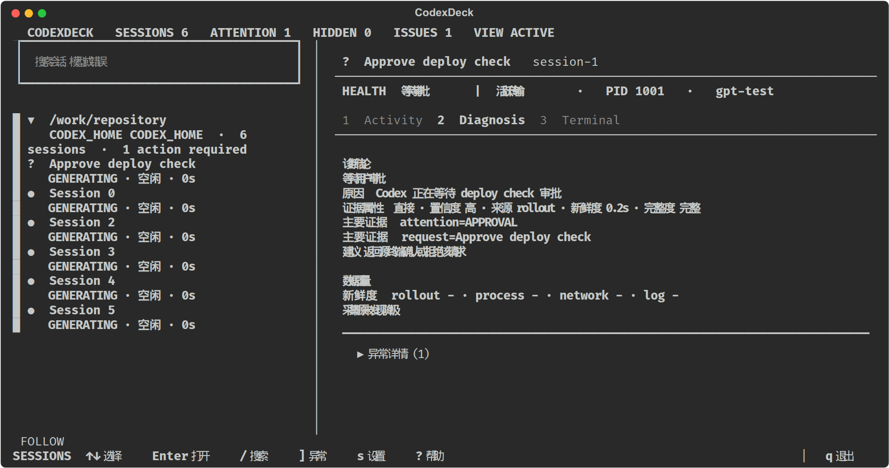

<div align="center">

# CodexDeck

### 所有本地 Codex 会话，一块准确、只读的运行态观测控制台

[](https://github.com/Telecaster2147/CodexDeck)
[](https://www.python.org/)
[](https://textual.textualize.io/)
[](#运行要求)
[](#只读与隐私边界)
[](LICENSE)

</div>

> [!NOTE]
> **项目状态：** `0.4.0`。CodexDeck 面向 Linux 上同时运行多个 Codex 会话的开发者，集中显示
> 哪些会话仍在工作、正在等你、已经失败，或只是缺少足够证据。



<p align="center">
  <sub>匿名 fixture 生成：导航、header 与 Inspector 来自同一个 published snapshot。</sub>
</p>

Codex CLI 擅长处理一个终端中的任务；当多个 workspace、worktree、后台命令和 Codex Home
同时运行时，状态会散落在不同终端。CodexDeck 汇总当前用户已经可读的协议、进程、SQLite、
终端记录和网络证据，形成一个安静的 operations console。

**它最适合：** 经常在同一个 Linux、WSL、SSH 或 VM 环境中并行运行多个 Codex 会话，需要快速
定位待审批、失败、停顿和后台命令的开发者。只有一个会话时，直接看原 Codex 终端通常更简单。

- **谁还在工作？** 生成、compact、运行具体工具，还是等待上游？
- **谁需要处理？** 审批、权限、输入、登录或当前失败在哪里？
- **谁真的停顿？** 正常静默、采集盲区、疑似停顿和已确认 stall 分开显示。
- **结论凭什么？** Diagnosis 展示稳定 reason code、置信度、新鲜度和有界 evidence timeline。

> [!IMPORTANT]
> CodexDeck 只观察。它不接管 PTY，不轮询另一个 CLI，不修改 Codex 配置/rollout/SQLite，
> 不写 stdin，不发 signal，也不代理或解密网络流量。

## 30 秒快速开始

1. 在多个终端、workspace 或 worktree 中照常启动 Codex。
2. 在同一个 Linux kernel/user 环境中运行 `codexdeck`。
3. 按 `]` 跳到下一个待处理或异常会话。
4. 按 `2` 查看 Diagnosis，按 `3` 查看已持久化的 Terminal 证据。
5. 根据 workspace、PID、TTY、cwd、tmux/VS Code/SSH 线索回到原终端处理。

Terminal 页不是 Codex PTY 的实时镜像；它只展示已持久化或符合边界检查的输出证据。

## 安装

安装器只写当前用户目录，不需要 root。建议先下载并检查脚本：

```bash
curl -fsSL \
  https://raw.githubusercontent.com/Telecaster2147/CodexDeck/v0.4.0/install.sh \
  -o /tmp/codexdeck-install.sh
less /tmp/codexdeck-install.sh
sh /tmp/codexdeck-install.sh
codexdeck --version
codexdeck
```

安装器验证 Linux、Python 3.10+、`ps`、wheel SHA-256，并在
`~/.local/share/codexdeck` 创建独立环境。缺少 `ss` 时仅网络证据降级。

固定版本或关闭颜色：

```bash
sh /tmp/codexdeck-install.sh --version 0.4.0
sh /tmp/codexdeck-install.sh --no-color
```

升级时重新运行安装器；新环境通过 `codexdeck --version` smoke 后才替换旧环境。

### 从源码运行

```bash
git clone https://github.com/Telecaster2147/CodexDeck.git
cd CodexDeck
uv sync
uv run codexdeck
```

也可以使用 `pipx install .`。卸载说明和本地 wheel 安装参数见 `install.sh --help` 与
`uninstall.sh --help`。

本地 wheel 安装需要同时提供校验文件，例如
`dist/codexdeck-0.4.0-py3-none-any.whl.sha256`；安装器会先验证摘要再创建环境。

## 常用工作流

```bash
# TTY 默认进入 Textual TUI
codexdeck

# 两秒完整采样后输出 text / JSON
codexdeck monitor --once
codexdeck monitor --once --format json

# 持续 NDJSON
codexdeck monitor --watch --format ndjson

# 过滤实例或进程
codexdeck monitor --pid PID
codexdeck monitor --codex-home CODEX_HOME_A --codex-home CODEX_HOME_B

# 检查 discovery、数据源、兼容 family 与 collector 健康
codexdeck doctor
codexdeck doctor --format json

# 导出单个会话的有界当前报告；不含 transcript 正文
codexdeck export --session SESSION_ID
```

普通 one-shot 退出 `0` 只表示没有命中 workload incident，不表示所有证据完整。
`--strict-observation` 可把 active observer degradation 作为退出码 `5` 报告。完整参数见
`codexdeck --help` 和子命令帮助。

## TUI 导览

宽屏使用持久导航与 Inspector；小于 96 列切换为列表/详情下钻；小于 `50×20` 显示尺寸提示。
Inspector 固定为：

| 页面 | 内容 |
| --- | --- |
| **Activity** | 请求、模型、工具、文件、compact、恢复和失败时间线 |
| **Diagnosis** | 当前结论、reason code、证据、完整性、数据新鲜度与脱敏诊断 |
| **Terminal** | 有界只读 transcript，保留 `OUT` / `ERR` / `TTY` / `SYS` 来源 |

常用快捷键：

| 操作 | 按键 |
| --- | --- |
| 移动 / 进入 | `j`、`k`、方向键、`Enter` |
| 下一个待处理或异常会话 | `]` |
| Activity / Diagnosis / Terminal | `1` / `2` / `3` |
| 筛选、搜索结果、末尾跟随 | `/`、`n`、`Shift+N`、`f` |
| 完整采样、设置、帮助、退出 | `r`、`s`、`?`、`q` |
| 分组、隐藏、放大、返回、中断 | `g`、`h`、`z`、`Esc`、`Ctrl+C` |

Terminal 搜索只搜索内存中已保留的内容；`f` 只从末尾启用 follow。正常刷新不会重建稳定导航、
抢焦点或强推滚动到底部。

## 核心能力

| 领域 | 行为 |
| --- | --- |
| 多实例发现 | 区分 `(CODEX_HOME, CODEX_SQLITE_HOME)`，按真实 workspace 组织会话 |
| 生命周期 | 协议事件决定 waiting/generating/tool/compacting/completed/failed |
| Needs You | 统一审批、权限、用户输入、MCP/auth elicitation，并按优先级导航 |
| Terminal | 关联 exec、后台 yield、poll/write、完成记录与合格的 fd 1/2 普通文件 |
| 网络 | 聚合同进程全部 flow；连续异常窗口且无协议进展才确认 stall |
| 证据完整性 | lifecycle、attention、failure/recovery、terminal、network、silence 分轴降级 |
| 多种输出 | TUI、text、JSON/NDJSON、doctor 和单 session export 共享同一快照语义 |

### 独立状态轴

CodexDeck 不使用一个含糊的总健康枚举：

- **Lifecycle**：idle、waiting、generating、running tool、compacting、failed、ended；
- **Attention**：approval、permissions、user input、MCP/auth elicitation；
- **Failure / recovery**：failure、suspect、reconnecting、fallback、recovered；
- **Network**：unknown、idle、active、suspect、stalled、closed；
- **Silence**：normal、quiet active、waiting upstream、quiet unknown、observer blind。

协议 phase 是 lifecycle 权威；进程、Terminal、socket 和 SQLite 只补充各自领域。缺失、截断、
陈旧、冲突或 unknown 表示“没有观察全”，不等价于“确认不存在”。详细规则见
[`EVIDENCE_MODEL.md`](EVIDENCE_MODEL.md) 与 [`STATE_MODEL.md`](STATE_MODEL.md)。

### 双采样路径

| 节奏 | 内容 |
| --- | --- |
| 完整采样，默认 2 秒 | 发现、进程存活、SQLite、`ss`、collector health、普通文件 tail、stall 分类 |
| 快速刷新，100 ms | 已知 rollout 增量、规范化事件、durable terminal poll output |

所有入口最终发布结构冻结的 `MonitorSnapshot`。没有可见变化时快速路径复用原对象；有变化时只
替换相关分支，旧快照的可达对象保持稳定。

## 结构化输出合同

| Surface | 版本 | 用途 |
| --- | ---: | --- |
| JSON / NDJSON snapshot | `schema_version: 1` | 自动化巡检与持续采样 |
| Doctor JSON | `doctor_schema_version: 2` | 数据源、collector 与兼容性诊断 |
| Session export | `export_schema_version: 3` | 单会话有界当前报告 |

JSON/NDJSON 是核心 machine-readable surface；doctor 和 export 分别演进。增加有明确长度、隐私、
脱敏和投影合同的 nullable 字段属于 additive change。删除/重命名字段、改变类型、nullability 或
领域语义属于 breaking change，必须提升对应 schema version 并记录在 release notes。
replay manifest 与 fixtures 仅为仓库测试资产，不作为公开 machine API。

典型 session 同时包含当前状态、每轴 completeness、稳定 reason code 和有界 evidence timeline。
Diagnosis、text、JSON 和 export 从同一个领域投影生成，不各自重新猜测状态。

## 设置

按 `s` 打开设置中心，可持久化分组、隐藏会话、follow 和主题。Activity 保持默认 Inspector 页面；
命令行 `--flat` 只覆盖本次运行。设置只写 CodexDeck 自己的配置：

```text
$XDG_CONFIG_HOME/codexdeck/preferences.json
```

未设置 `XDG_CONFIG_HOME` 时使用 `~/.config/codexdeck/preferences.json`。Codex 配置保持原样。

## 输出与隐私

| 输出 | Transcript 正文 |
| --- | --- |
| TUI Terminal | 仅本地有界内存中显示 |
| Text / JSON / NDJSON | 不输出 |
| Doctor / Export | 不输出，只保留有界摘要 |

- Terminal 上限：单 terminal 2 MiB 或 4,000 chunks；单 session 16 个；全局 16 MiB。
- 对已知 Bearer/Basic、常见 token、AWS key、JWT、带凭据 URL/DSN、PEM key 与 Cookie 做
  best-effort 脱敏；未知自定义秘密仍需人工检查。
- 普通文件 tail 只检查子进程 fd 1/2，目标必须是 workspace 或 `/tmp` 下普通文件；跳过 PTY、
  pipe、socket、字符设备和无关文件。
- JSON/NDJSON、doctor、export 使用 deny-by-default 字段投影；新增内部字段默认不公开。
- 会话标题、任务摘要、路径、端点、错误和本地截图仍可能敏感，分享前请人工检查。

## 运行要求

| 项目 | 要求 |
| --- | --- |
| 操作系统 | Linux；WSL、SSH、VM 按 CodexDeck 所在 kernel/user 解释 |
| Python | 3.10+ |
| 系统命令 | 必需 `ps`；可选网络证据 `ss`（通常来自 `iproute2`） |
| 权限 | 当前用户 Codex 进程、对应 `/proc` 与 Codex 数据目录的读取权限 |

一个 CodexDeck 进程只观察一个 Linux kernel/user 环境，不做跨主机聚合。

## 文档索引

| 文档 | Ownership |
| --- | --- |
| [`ARCHITECTURE.md`](ARCHITECTURE.md) | 模块边界、依赖方向、state ownership、published snapshot |
| [`EVIDENCE_MODEL.md`](EVIDENCE_MODEL.md) | 证据权威、身份、时序、完整性、reason 与 publication |
| [`STATE_MODEL.md`](STATE_MODEL.md) | lifecycle、attention、recovery、silence 与推导顺序 |
| [`PROTOCOL_COMPATIBILITY.md`](PROTOCOL_COMPATIBILITY.md) | Codex family registry、rolling fixture window、schema policy |
| [`TERMINAL_OBSERVABILITY.md`](TERMINAL_OBSERVABILITY.md) | 关联、capability、retention、file tail 与隐私 |
| [`NETWORK_MODEL.md`](NETWORK_MODEL.md) | socket 聚合、stall、stale 与采集边界 |
| [`TESTING.md`](TESTING.md) | 单测、ground truth、replay、性能、真实 PTY 与 RC gates |
| [`RELEASE_OBSERVABILITY.md`](RELEASE_OBSERVABILITY.md) | 无遥测发布后 24h/72h/周度健康复盘 |

## 许可证

CodexDeck 使用 [MIT License](LICENSE)。

---

<div align="center">
  <strong>CodexDeck</strong><br>
  <sub>Observe every session. Preserve every boundary.</sub>
</div>
